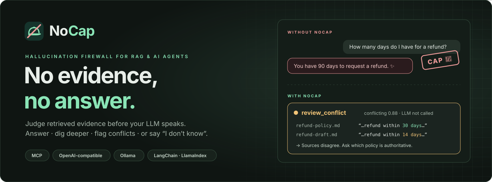
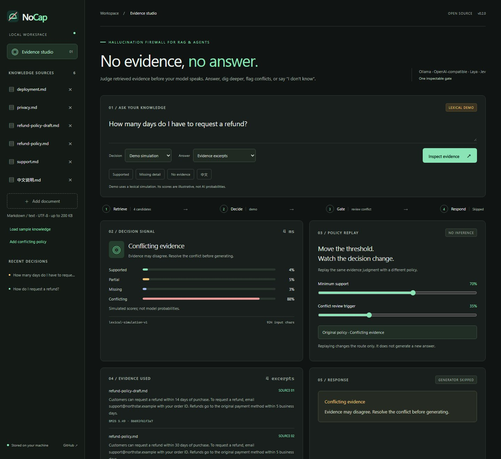
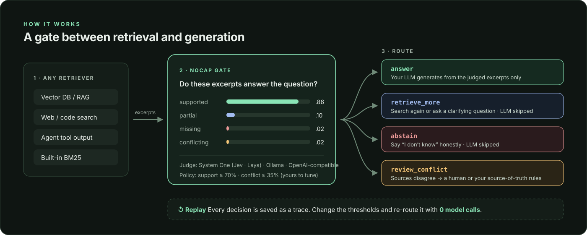
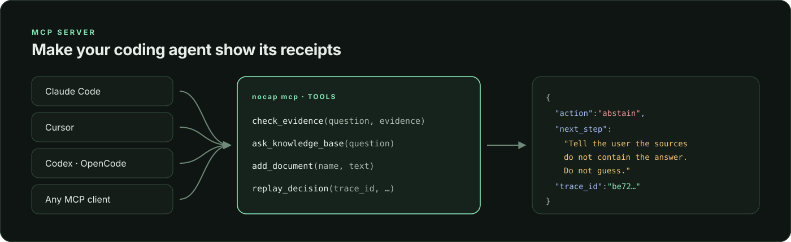
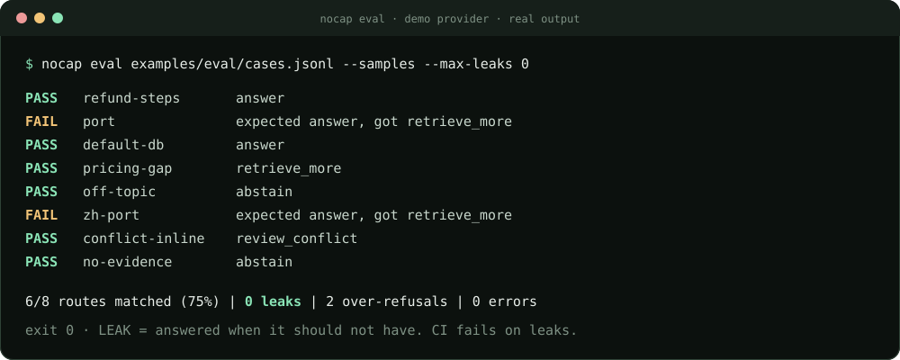
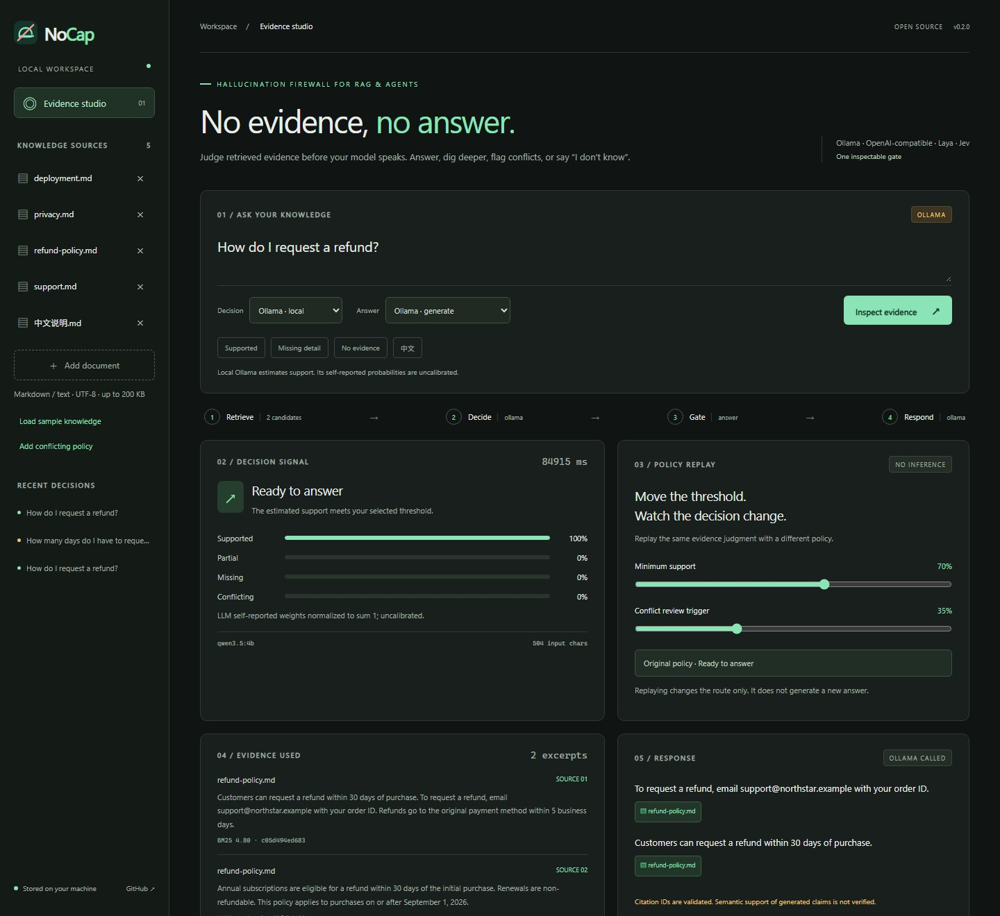

<p align="center"></p>

<p align="center">
  <a href="https://github.com/xi029/nocap/actions/workflows/ci.yml"></a>
  <a href="https://pypi.org/project/nocap/"></a>
  
  
  <a href="LICENSE"></a>
  <a href="https://github.com/xi029/nocap/stargazers"></a>
</p>

<p align="center">
  <b>你的 RAG 在“吹牛”。🧢</b><br>
  NoCap 在大模型开口<i>之前</i>，先判断检索到的证据到底能不能回答这个问题，<br>
  再决定：<b>回答</b>、<b>继续检索</b>、<b>拒答</b>，还是<b>标记冲突</b>。
</p>

<p align="center">
  <a href="README.md">English</a> ·
  <a href="#-60-秒上手">快速开始</a> ·
  <a href="#-三种接入方式">SDK · MCP · HTTP</a> ·
  <a href="#-给幻觉写单元测试">CI</a> ·
  <a href="docs/providers.md">模型配置</a> ·
  <a href="docs/mcp.md">MCP 指南</a>
</p>

---

## 🧢 为什么需要它

大多数 RAG 直接把 top-k 片段塞给生成模型。可这些片段经常只是*提到*了主题，或者缺了关键细节，甚至彼此矛盾。模型照样会把空白补上，而且说得非常笃定。

> “No cap” 是英语俚语，意思是“不吹牛、说真的”。NoCap 在检索和生成之间加了一步：
> **这些片段对这个问题是：完全支持、部分支持、缺失，还是互相冲突？**
> 接下来怎么走，由你设定的策略决定。

<table>
<tr>
<th width="50%">没有 NoCap</th>
<th width="50%">有 NoCap</th>
</tr>
<tr>
<td>

```text
问：退款期限是多少天？
答：您有 90 天时间申请退款。✨   ← 编的
```

</td>
<td>

```text
问：退款期限是多少天？
→ review_conflict（冲突概率 0.88）
  refund-policy.md：“30 天内”
  refund-draft.md： “14 天内”
  未调用 LLM，请确认哪份文档为准。
```

</td>
</tr>
</table>

## ✨ 功能一览

| | 功能 | 价值 |
| --- | --- | --- |
| 🛡️ | **证据门控** | 四种路由：`answer` · `retrieve_more` · `abstain` · `review_conflict`。只有 `answer` 才会调用你的生成模型。 |
| 🐍 | **3 行 Python SDK** | 用 `@gate.guard` 包住任意生成函数。支持字符串、dict、LangChain `Document` 和 LlamaIndex 节点。 |
| 🤖 | **MCP Server** | 给 Claude Code、Cursor、Codex 等任意 MCP Agent 加上 `check_evidence` 工具。 |
| 🔌 | **任意模型当裁判** | Ollama，任意 **OpenAI 兼容接口**（OpenAI、DeepSeek、通义千问、Kimi、vLLM、LM Studio…），开源 Laya，托管 Jev。 |
| 🧪 | **给幻觉写单元测试** | `nocap eval` 跑带标注的路由用例，一旦出现**漏放**就让 CI 失败；也提供 GitHub Action。 |
| ⏪ | **零成本策略回放** | 对已保存的判断改阈值，重新算路由，**不再调用任何模型**。 |
| 🔍 | **可审计 Trace** | 送给模型的原始片段、概率分布、耗时和引用都导出为 JSON，并带永久链接。 |
| 🏠 | **本地优先** | FastAPI + SQLite + 免构建前端。演示模式不需要 Key、模型、Embedding 或向量库。 |

## 🚀 60 秒上手

```sh
pip install nocap
nocap demo     # 载入虚构示例文档
nocap serve    # 打开 http://127.0.0.1:8787
```

也可以用 [uv](https://docs.astral.sh/uv/) 从源码运行：`git clone https://github.com/xi029/nocap && cd nocap && uv sync && uv run nocap demo && uv run nocap serve`。

默认的 **demo** 裁判是明确标注的词法模拟，可以完全离线体验所有功能。在界面里或用 `NOCAP_PROVIDER` 切换到真实模型（见[模型配置](#-自带裁判模型)）。



<sub>真实工作台截图（演示模式）。演示分数是词法模拟，不是 AI 概率。</sub>

**试试看：** 问 “How do I request a refund?” → 把 **Minimum support** 拖到 95%，路由会变，但没有任何模型调用 → 点 **Add conflicting policy** 再问一次。

## 🔌 三种接入方式



### 1. Python SDK：包住你的生成函数

```python
from nocap import Gate

gate = Gate(provider="openai")  # 或 "ollama"、"laya"、"jev"、"demo"


@gate.guard(fallback="文档里没有找到相关信息。")
def answer(question, evidence):
    return llm(question, evidence)  # 只有证据足够时才会执行


answer("怎么申请退款？", retriever.invoke("怎么申请退款？"))
```

需要细节？`verdict = gate.check(question, docs)` 会返回 `verdict.action`、`verdict.probabilities`、`verdict.evidence` 和 `verdict.ok`，也支持 async 函数。可运行示例：[`examples/quickstart.py`](examples/quickstart.py)。

### 2. MCP：让你的 Agent “拿出证据”

```sh
claude mcp add nocap -e NOCAP_PROVIDER=ollama -- uvx --from "nocap[mcp]" nocap mcp
```



Agent 会获得 `check_evidence`、`ask_knowledge_base`、`add_document`、`replay_decision` 四个工具。每次判定都带一个 `next_step`，例如“告诉用户资料中没有答案，不要猜”。Cursor、Claude Desktop、Codex 的配置见 [MCP 指南](docs/mcp.md)。

### 3. HTTP：任何语言、任何技术栈

```sh
curl -s http://127.0.0.1:8787/api/decide -H "Content-Type: application/json" -d '{
  "question": "How do I request a refund?",
  "evidence": [{"id": "r1", "source": "refund-policy.md",
                "text": "To request a refund, email support with the order number."}]
}'
# → {"action": "answer", "reason": "...", "decision": {"probabilities": {...}}, ...}
```

| 路由 | 你的应用应该怎么做 |
| --- | --- |
| `answer` | 用**返回的**（已被判断过的）片段生成答案 |
| `retrieve_more` | 重新检索、追问用户或停止；限制重试次数 |
| `abstain` | 直接说“不知道”，跳过生成 |
| `review_conflict` | 把冲突来源交给人工或你的“以谁为准”规则 |

详见[接入指南](docs/integration.md)与 [API 文档](docs/api.md)。

## 🧪 给幻觉写单元测试

先写下你期望的路由，一旦 RAG 在证据不足时仍然作答，就让构建失败。

```jsonl
{"id": "refund", "question": "How do I request a refund?", "expect": "answer"}
{"id": "pricing", "question": "What is the exact team plan pricing?", "expect": "retrieve_more"}
{"id": "off-topic", "question": "Who won the lunar chess championship?", "expect": "abstain"}
```

```sh
nocap eval cases.jsonl --docs ./knowledge --provider ollama --max-leaks 0
```



**漏放（leak）**：本该拦下却放行了回答。**过度拒答（over-refusal）**：证据足够却拦下了。两者都会统计，由你决定哪个让 CI 失败。作为 GitHub Action 使用：

```yaml
- uses: xi029/nocap@v0.2.0
  with:
    cases: tests/rag-cases.jsonl
    docs: knowledge/
    provider: openai          # 在 env 中设置 NOCAP_OPENAI_*
    max-leaks: 0
```

## 🧠 自带裁判模型

| Provider | 配置 | 分数含义 |
| --- | --- | --- |
| `ollama` | `ollama pull qwen3.5:4b`，选择 **Ollama · local** | 模型自报，归一化，未校准 |
| `openai` | `NOCAP_OPENAI_URL`、`NOCAP_OPENAI_MODEL`、`NOCAP_OPENAI_API_KEY`；支持 OpenAI、DeepSeek、通义千问 DashScope、OpenRouter、vLLM、LM Studio | 模型自报，归一化，未校准 |
| `laya` | 自部署 [Laya](https://github.com/NandhaKishorM/laya) `/v1/systemone` | 选择头分布，默认对 4 种标签顺序取平均 |
| `jev` | [TypeSafe Jev](https://docs.typesafe.ai/introduction) API Key | 托管决策分布 |
| `demo` | 无需配置 | 词法模拟，仅用于体验界面 |

```dotenv
# .env：以 DeepSeek 作为裁判为例
NOCAP_PROVIDER=openai
NOCAP_OPENAI_URL=https://api.deepseek.com/v1
NOCAP_OPENAI_MODEL=deepseek-chat
NOCAP_OPENAI_API_KEY=sk-...
```

通义千问可用 `https://dashscope.aliyuncs.com/compatible-mode/v1`。所有裁判回答同一个类型化问题，策略、Trace 和回放完全一致。[模型配置与排错 →](docs/providers.md)

<details>
<summary><b>真实本地运行：qwen3.5:4b 判断证据并带引用回答</b></summary>



这是一次真实请求，不是演示模拟。在这台只用 CPU 的 Windows 机器上，端到端大约 85 秒；速度完全取决于你的硬件和模型。

</details>

## ⏪ 策略回放

每次判定都会保存完整的概率分布。拖动阈值后，NoCap 直接根据已保存的判断重新计算路由，**不产生任何新的模型调用**，原始回答仍与原策略绑定。上线更严格的策略之前，先看看它会拦下多少问题。

```sh
uv run python examples/replay.py    # 离线回放一条真实 Qwen trace
```

## 🤔 和其他工具有什么不同？

- **评测框架**（RAGAS、DeepEval、promptfoo…）通常在生成*之后*、离线给答案打分。NoCap 在生成**之前**做**运行时路由决策**，可以直接跳过生成。两者可以一起用：`nocap eval` 测的是路由，不是答案质量。
- **Guardrail 类库**大多校验*输出*（格式、毒性、隐私）。NoCap 判断的是*输入*能否支撑一个答案，并告诉你该回答、继续找、拒答还是升级处理。
- **“只根据上下文回答”的 Prompt** 把判断留在了写答案的同一次调用里。NoCap 把它拆成独立、可审计、可回放、阈值可调的一步。

## 📏 坦诚的局限

- `answer` 只表示“达到你的阈值”，不保证为真。LLM 裁判未经校准，请在你自己的标注问题上验证阈值。
- 生成答案的引用只校验 **ID** 是否合法，不校验语义蕴含。
- 内置检索器是 BM25（无 Embedding）。需要语义检索时，通过 SDK、MCP 或 `/api/decide` 接入你自己的检索器。
- 自带的 8 条用例只是冒烟测试，不是基准。我们不发布编造的准确率、速度或“幻觉降低”数字。[评测方法 →](docs/evaluation.md)
- 本地单用户工作台，没有鉴权。见 [SECURITY.md](SECURITY.md)。

## 🗺️ 路线图

- [x] OpenAI 兼容裁判 · MCP Server · Python SDK · `nocap eval` + GitHub Action
- [ ] 生成答案的逐条声明蕴含检查
- [ ] 基于标注集的风险 / 覆盖率曲线
- [ ] 原生 LangChain `Runnable` 与 LlamaIndex 后处理器封装
- [ ] 可分享、可脱敏的 Trace 卡片
- [ ] OpenAI 兼容**代理模式**：把 NoCap 挡在任意聊天应用前面

欢迎提想法和 PR：见 [CONTRIBUTING.md](CONTRIBUTING.md) 或[提交 Issue](https://github.com/xi029/nocap/issues)。

## ⭐ 支持

如果 NoCap 帮你的机器人少编了一次答案，**点个 Star 能让更多开发者看到它。**

<a href="https://star-history.com/#xi029/nocap&Date"></a>

## 许可证

[Apache-2.0](LICENSE)。NoCap 是独立项目。感谢 [Laya](https://github.com/NandhaKishorM/laya)、[TypeSafe](https://docs.typesafe.ai/api)、[Ollama](https://github.com/ollama/ollama) 和 [Model Context Protocol](https://modelcontextprotocol.io)。不包含模型权重，上游模型遵循各自许可证。见 [NOTICE](NOTICE)。
